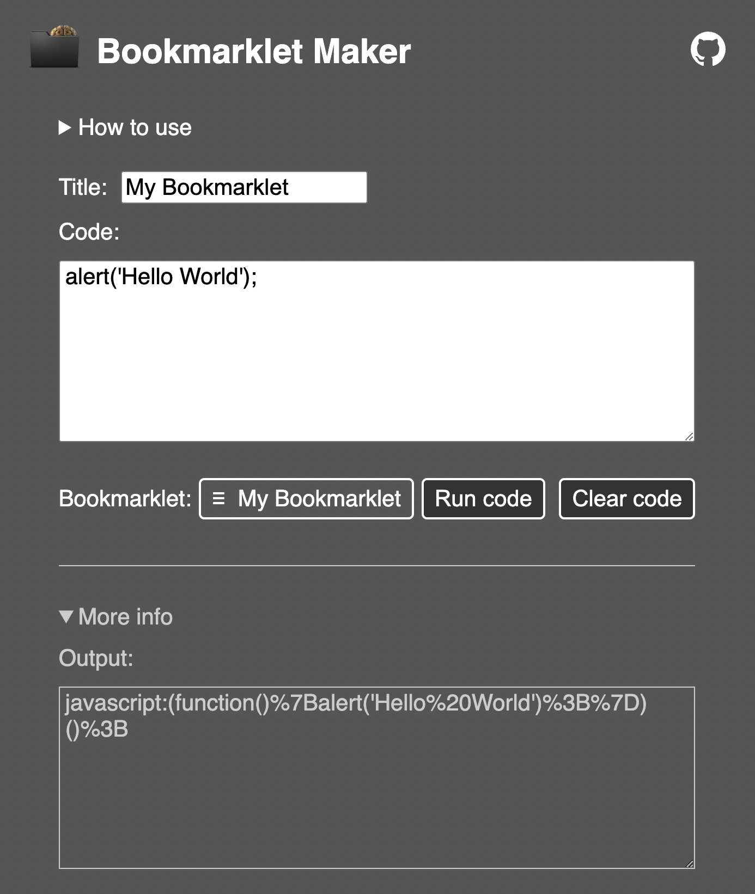

# Bookmarklet Maker
Bookmarklets are browser bookmarks that execute JavaScript instead of opening a webpage. They're also known as bookmark applets, favlets, or JavaScript bookmarks.

1. Type or paste your JavaScript code into the textbox.
1. Drag and drop your bookmarklet to your browsers bookmark toolbar.

